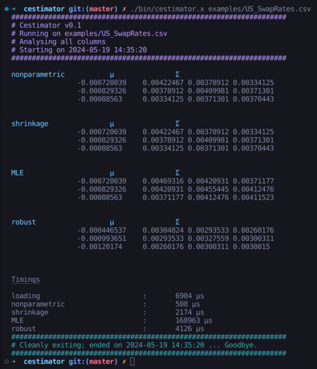

# Cestimator


This is a first pass at my implementation of estimators of distributions. This will highlight a few different types of estimation that encompass a large class of realistic distribution, specifically elliptically distributed realisations of a random variable.

The goal is to show how these estimations perform for different regimes of data quality and covariance. 

The types of estimation that are covered are (i) non-parametric estimation (the naïve approach), (ii) shrinkage estimation, (iii) maximum likelihood estimation, and (iv) robust estimation, to discuss the impact of missing data or to cover the cases where the test distributions used in (i-iii) do not really cover the true distribution.

Details on these estimators can be found in the [docs](https://github.com/trbritt/cestimator/tree/master/docs).

## Output

The output is simply formatted as text to stdout for now.



## Compilation

To build the program requires only the `Eigen3` library as a prerequisite. Other than that, just run `make` and you'll be on your way. All object files and the executable will be created in the `./bin` directory. 

## Usage

The programme as built is designed to take in a CSV file, where a column is the time history of the variable of interest. The CSV should have multiple columns corresponding to the quantities the user believes to be codistributed. In this case, the programme can be run by then specifying the columns of the CSV which the user wishes to analyse:

```bash
./bin/cestimator.x <data_file.csv> col1 col2
```

The programme is geared at identifying statistically invariant quantities, so it considers the linear difference (linear returns in the case of market invariants) and determines the distribution of those quantites.


## License

This code is distributed under the GPLv3 license.